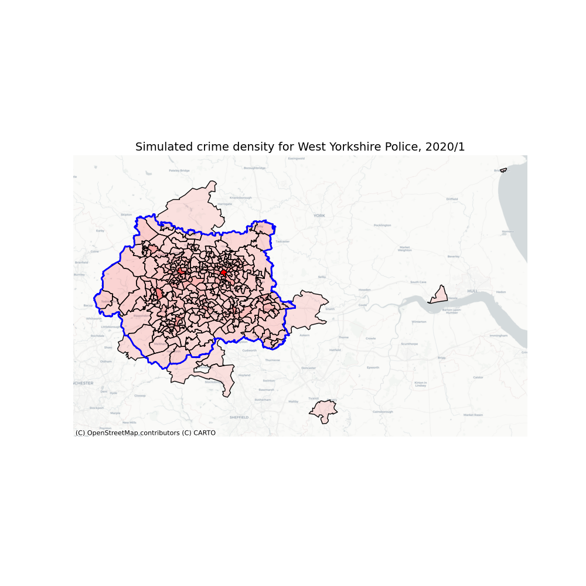

# CriMS

Policing and Crime supply-demand modelling. *CriMS* is an evolution of **crime-sim-toolkit** <sup>[[6]](#references)</sup> and forms the microsynthesis and microsimulation components of this workflow:


## Population Data

Uses the **ukcensusapi** <sup>[[1]](#references)</sup> and **ukpopulation** <sup>[[2]](#references)</sup> packages to generate MSOA-level population data derived from the 2011 census and scaled to 2020 subnational population projections.

## Crime Data

Uses the **police-api-client** <sup>[[3]](#references)</sup> and the **police open data portal** <sup>[[4]](#references)</sup> directly to get open data on crime occurrences.

## Model



Uses the **neworder** <sup>[[5]](#references)</sup> microsimulation framework to run the model. It uses historical data to determine counts of crimes as a function of location (MSOA), time (month), and (broad) type, so can capture seasonal fluctuations in crime frequency. It then imposes further weekly and daily periodicity to the crime rate, and this to sample crime incidences from a non-homogeneous Poisson process. More detailed crime types, and whether a suspect has been identified, are also sampled at force area resolution. This synthetic crime data can be fed into an agent-based model of Police operations which can alter its policies, potentially feeding back changes to crime rates that may result.

### Planned Model Enhancements

- [ ] Capture temporal trends in crime rates (as well as seasonality)
- [ ] Capture daily and weekly periodicity of crimes by crime type
- [ ] Alter crime incidence rates according to feedback from upstream model

## Data sources

- Bulk crime and outcome data, force boundaries: [data.police.uk](<https://data.police.uk>)
- Mapping between Home Office Offence Codes and the data.police.uk categories. : [data.police.uk](<https://www.police.uk/SysSiteAssets/police-uk/media/downloads/crime-categories/police-uk-category-mappings.csv>)

<!--- Sample (interim) victim data from **crime-sim-toolkit** <sup>[[6]](#references)</sup>-->

- MSOA (2011) boundaries: [geoportal.statistics.gov.uk](<https://geoportal.statistics.gov.uk/datasets/middle-layer-super-output-areas-december-2011-ew-bsc-v2>)
- [Detailed crime counts by ONS classification](https://assets.publishing.service.gov.uk/government/uploads/system/uploads/attachment_data/file/928924/prc-pfa-mar2013-onwards-tables.ods)
- [Crime severity scores](https://www.ons.gov.uk/peoplepopulationandcommunity/crimeandjustice/datasets/crimeseverityscoreexperimentalstatistics)

### Mapping crime types to counts and severity weights

Crimes are sampled only by the 14 broad Police.UK categories, since this is the only categorisation in the bulk data. Police.UK also provide a breakdown of finer crime types by category.

ONS provide annual counts of crimes by force area in a more detailed categorisation with 134 distinct types, including the home office code for each type

However, the resourcing impact on the police of different crimes varyies enormously and "severity scores" are given by crime type for 246 detailed crime descriptions, including the home office code.

The first two datasets are not consistent, and require manual (i.e. insightful) matching of the finer/detailed crime type across the two datasets, which in turn allows weighted sampling of the *ONS* finer crime categorisation from the *Police.UK* broad category.

The home office codes can then be used to join the crime counts and their severity scores, so that the data supplied to the upstream (agent-based) model includes a measure of the police resourcing required to deal with each simulated crime. This step is can be done programmatically, and the code is given in [weights.py](./weights.py)

The mapping dataset is in [data/policeuk-ons-code-join.csv](./data/policeuk-ons-code-join.csv)

| File              | File Description                                                                                   | Download Location                                                                                                                         | Links to                    | Via Col(s)                                                                   | Linking Method | Column Prefix in Matched File |
|-------------------|----------------------------------------------------------------------------------------------------|-------------------------------------------------------------------------------------------------------------------------------------------|-----------------------------|------------------------------------------------------------------------------|----------------|-------------------------------|
| ONS_COUNTS        | Detailed crime counts by ONS classification by police force area by calendar year                  | https://assets.publishing.service.gov.uk/government/uploads/system/uploads/attachment_data/file/928924/prc-pfa-mar2013-onwards-tables.ods | ONS_SEVERITY_               | ONS_COUNTS_code == ONS_SEVERITY_code                                         | Programatic    | ONS_COUNTS_                   |
| ONS_SEVERITY      | ONS Crime Severity Scores by offence type                                                          | https://www.ons.gov.uk/peoplepopulationandcommunity/crimeandjustice/datasets/crimeseverityscoreexperimentalstatistics                     | ONS_COUNTS_                 | ONS_COUNTS_code == ONS_SEVERITY_code                                         | Programatic    | ONS_SEVERITY_                 |
| POLICE_UK_CAT_MAP | Mapping between Home Office Offence Codes and descriptions and the data.police.uk broad categories | https://www.police.uk/SysSiteAssets/police-uk/media/downloads/crime-categories/police-uk-category-mappings.csv                            | ONS_COUNTS_ & ONS_SEVERITY_ | POLICE_UK_CAT_MAP_Offence ~=~ ONS_SEVERITY_offence or ONS_COUNTS_description | Manual         | POLICE_UK_CAT_MAP_            |

## Usage

First install dependencies

```bash
pip install -r requirements.txt
```

The script `run_model.py` can be used to run the model on a single force area and plot some output. Change the force area by editing the script. Run it like so:

```bash
python run_model.py "West Yorkshire" 2020 2022
```

which will simulate crime occurrences for West Yorkshire Police for 3 years, from 1/1/2020 to 31/12/2022. Note that some the crime locations may not be within the force area.

## Output

The model produces simulated crime data in four variables:

- spatial: MSOA in which the crime occurred
- temporal: the time at which the crime occurred/was reported/was responded to. (TODO which?)
- categorical:
  - the type of the crime
  - whether a suspect has been identified

## App Service

### Building

The app's data is in a separate image due to its size and infrequent changes. Build and push this image only as necessary:

```bash
docker build -t mopd/crims-data -f Dockerfile.data .
docker push mopd/crims-data
```

The app itself it more lightweight, and uses the data as a base image

```bash
docker build -t mopd/crims -f Dockerfile.app .
docker push mopd/crims
```

### Running

To run locally

```bash
FLASK_APP=server.py flask run
```

which exposes an API at port 5000 with two endpoints:

#### `/data`

Takes 2 query params, `force` and `month` plus an optional param `format` (which defaults to `json`), and returns one month's simulated crime data for a given force area, e.g.

`http://localhost:5000/data?force=Durham&month=7`

`http://localhost:5000/data?force=City%20of%20London&month=2&format=csv`

#### `/map`

Takes 2 query params, `force` and `month`, and returns crime density by MSOA plotted on a map.

`http://localhost:5000/map?force=Devon%20and%20Cornwall&month=12`

#### Docker

##### App Service Container

This service is available as a docker image (due to its size and relatively infrequent changes, the data is in a separate image - which will take a while to initially download):

```bash
docker pull mopd/crims
docker run --rm -d  -p 80:5000/tcp mopd/crims
```

which runs it locally, listening for requests on the default http port. You can then request data from the container, e.g. in python/pandas:

```python
>>> import pandas as pd
>>> df1 = pd.read_csv("http://localhost/data?force=City%20of%20London&month=3&format=csv")
>>> df1.head()
        MSOA                    crime_type                                  description                 time  suspect
0  E02006924  violence and sexual offences  Sexual assault on a female aged 13 and over  2020-03-01 00:35:00    False
1  E02000001  violence and sexual offences                       Assault without injury  2020-03-01 02:09:00     True
2  E02000001                   other theft                                  Other theft  2020-03-01 02:37:00    False
3  E02000001                 vehicle crime             Interfering with a motor vehicle  2020-03-01 03:33:00    False
4  E02000001                   other theft                                  Other theft  2020-03-01 03:56:00    False
>>> df2 = pd.read_json("http://localhost/data?force=City%20of%20London&month=3", orient="table")
>>> df2.head()
        MSOA             crime_type                                description                time  suspect
0  E02000001  possession of weapons  Possession of article with blade or point 2020-03-01 00:09:00    False
1  E02000001            other theft                                Other theft 2020-03-01 00:44:00     True
2  E02000001          vehicle crime                         Theft from vehicle 2020-03-01 02:38:00    False
3  E02000001          vehicle crime                         Theft from vehicle 2020-03-01 05:28:00    False
4  E02000001               burglary            Burglary Business and Community 2020-03-01 06:39:00    False
>>>
```

##### Integrated Models Container

An interactive GUI-based demo of the model integration between the *crims* microsimulation and an agent-based *netlogo* model can be found in the `mopd/crims-int` container. The ABM currently performs the Schelling segregation model whilst also sampling crimes from *crims* and feeding back a (random) loading factor that increases or decreases the overall crime rate.

This is built with

```bash
docker build -t mopd/crims-int -f Dockerfile.int .
```

and requires permission to connect to the host's graphical display when it runs. On ubuntu, this works:

```bash
xhost +
docker run --rm -v /tmp/.X11-unix:/tmp/.X11-unix -e DISPLAY=$DISPLAY mopd/crims-int
```

on other platforms YMMV. Google is your friend.

## References

1. [ukcensusapi: UK census data query automation](<https://pypi.org/project/ukcensusapi/>)
2. [ukpopulation: UK Demographic Projections](<https://pypi.org/project/ukpopulation/>)
3. [police-api-client: Python client library for the Police API](<https://pypi.org/project/police-api-client/>)
4. [Police Open Data Portal](<https://data.police.uk/>)
5. [neworder: A dynamic microsimulation framework](<https://neworder.readthedocs.io>)
6. [crime-sim-toolkit](<https://github.com/M-O-P-D/crime_sim_toolkit>)

<!--[4] [humanleague: Microsynthesis using quasirandom sampling and/or IPF](<https://pypi.org/project/humanleague/>)-->
