# CriMS

Policing and Crime supply-demand modelling. *CriMS* is an evolution of **crime-sim-toolkit** [[6]] and forms the microsynthesis and microsimulation components of this workflow:

## Population Data

Uses the **ukcensusapi** [[1]](#references) and **ukpopulation** [[2]](#references) packages to generate MSOA-level population data derived from the 2011 census and scaled to 2020 subnational population projections.

## Crime Data

Uses the **police-api-client** [[3]](#references) to get open data on crime occurrences and some closed data to sample victim characteristics.

## Model

Uses the **humanleague** [[4]](#references) package to synthesise crime microdata, and the **neworder** [[5]](#references) microsimulation framework to run the model.

## Data sources

- Bulk crime and outcome data, force boundaries: [data.police.uk](https://data.police.uk)

- Sample (interim) victim data from **crime-sim-toolkit** [[6]]

- MSOA (2011) boundaries: [geoportal.statistics.gov.uk](<https://geoportal.statistics.gov.uk/datasets/middle-layer-super-output-areas-december-2011-ew-bsc-v2>)

## References

[1] [ukcensusapi: UK census data query automation](<https://pypi.org/project/ukcensusapi/>)

[2] [ukpopulation: UK Demographic Projections](<https://pypi.org/project/ukpopulation/>)

[3] [police-api-client: Python client library for the Police API](<https://pypi.org/project/police-api-client/>)

[4] [humanleague: Microsynthesis using quasirandom sampling and/or IPF](<https://pypi.org/project/humanleague/>)

[5] [neworder: A dynamic microsimulation framework](<https://neworder.readthedocs.io>)

[6] [crime-sim-toolkit](https://github.com/M-O-P-D/crime_sim_toolkit)